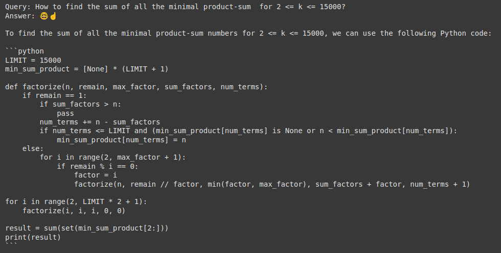

# RAG for Competitive Programming (rag_4_cpr)

**RAG for Competitive Programming (rag_4_cpr)** is a Retrieval-Augmented Generation (RAG) system designed to assist with solving competitive programming problems efficiently. The project aims to combine retrieval-based techniques with advanced LLM reasoning to deliver optimal solutions.

## Dataset
The dataset is sourced from **Project Euler** ([https://projecteuler.net/archives](https://projecteuler.net/archives)), specifically using the first 100 problems and solutions. Shout out to the Project Euler community for their exceptional resources.

## Tools and Frameworks
- **NVIDIA NIM API** ([https://build.nvidia.com/explore/discover](https://build.nvidia.com/explore/discover)): Used to integrate the **meta/llama3-8b-instruct** foundation model for generating responses.
- **SQLite3**: Database `cpr.db` is used to store problem-solution pairs, facilitating scalability through the pipeline in `./problems/main.py`.
- **Hugging Face**: Embedding generation with the `intfloat/e5-large-v2` model.
- **Chroma Vector Store**: Manages embeddings for retrieval tasks.
- **LangChain**: Facilitates prompt engineering, LLM integration, and retrieval workflows.

## Processing Pipeline
1. Retrieve problem-solution pairs from the `problem_solution` table in `cpr.db`.
2. Format the data into a list of dictionaries, each containing an ID and combined problem-solution text.
3. Generate embeddings using the Hugging Face `intfloat/e5-large-v2` model.
4. Initialize a Chroma vector store with the embeddings and associate metadata for problem retrieval.
5. Employ a custom prompt template to guide the **meta/llama3-8b-instruct** model to provide concise, performance-focused solutions.

## Output Example
Below is an example output, showcasing the system's reasoning and selected solutions.  

